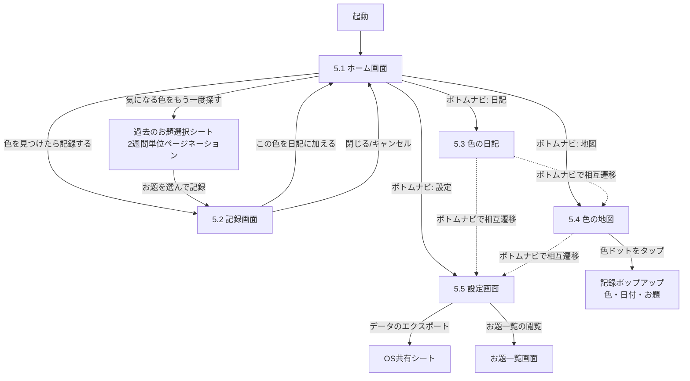
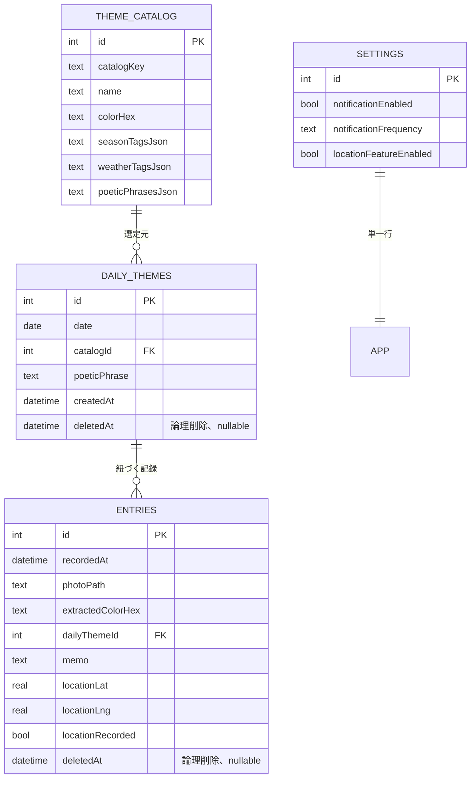

# そぞろいろ 設計書

作成日: 2026-08-16
更新日: 2026-08-17（未決事項に対するユーザー決定事項を反映）
前提ドキュメント: `そぞろいろ_要件定義書.md`（プロジェクトルート）、`tech-stack.md`（プロジェクトルート）

---

## 1. アーキテクチャ概要

Flutter単一コードベース・サーバーレス・オフラインファーストの4層構成とする。バックエンドは持たず、天気情報のみ外部公開APIを直接クライアントから呼び出す。

```
┌────────────────────────────────────────────┐
│ presentation層                                │
│  screens/ (Home, Record, Diary, Map, Settings)│
│  widgets/ (ColorSwatch, GradientRibbon 等)    │
│  providers/ (Riverpod: 画面状態・依存注入)      │
└───────────┬─────────────────────┘
            │ 参照
┌───────────▼─────────────────────┐
│ domain層                                      │
│  models/ (Theme, DailyTheme, Entry, Settings) │
│  usecases/ (ThemeSelector, NotificationScheduler)│
└───────────┬─────────────────────┘
            │ 参照
┌───────────▼─────────────────────┐
│ data層                                        │
│  repositories/ (Theme/Entry/Settings)         │
│  services/ (ColorExtraction, Weather, Location,│
│             Notification, Export)             │
│  db/ (Drift: AppDatabase, Tables, DAO)        │
└───────────┬─────────────────────┘
            │
      ┌─────┴──────┐
      ▼            ▼
 端末ローカル    外部API（任意・片方向）
 (SQLite/ファイル) Open-Meteo（天気取得）
                  MapTiler Cloud（地図タイル配信）
```

**設計方針**
- presentation層はdomain層のusecase/modelにのみ依存し、Drift等の実装詳細を直接知らない（repositoryインターフェース越しにアクセス）。
- 外部通信はWeatherService（天気取得）とMapTilerタイル配信の2系統のみ。位置情報トグルがOFFの端末では緯度経度を一切外部送信しない（詳細は7章）。MapTilerへのタイルリクエストは地図表示のための地図画像取得であり、個人を特定する情報は含まない。
- すべてのユーザーデータ（写真・記録・設定）は端末内で完結し、クラウド同期は行わない（tech-stack.md 3章・5章）。

---

## 2. 技術スタックと選定理由（要約）

詳細な比較検討・確定事項は `tech-stack.md` を参照。設計上の前提として以下を採用する。

| レイヤ | 採用技術 |
|---|---|
| フレームワーク | Flutter (Dart) |
| 状態管理 | Riverpod |
| ルーティング | go_router |
| ローカルDB | Drift (SQLite) |
| 画像保存 | ファイルシステム (`path_provider`) |
| 撮影 | `image_picker`（カメラソース） |
| 代表色抽出 | `palette_generator`（オンデバイス） |
| 位置情報 | `geolocator` |
| 地図表示 | `flutter_map` • **MapTiler Cloud**（無料枠: 月10万タイルロード） |
| 通知 | `flutter_local_notifications` |
| 天気情報 | Open-Meteo API（クライアント直叩き、オフライン時は季節タグのみにフォールバック） |
| エクスポート | `share_plus` • JSON/画像（サイズ上限なし） |
| バックエンド | なし |

---

## 3. 画面遷移

要件定義書5章の5画面のうち、「記録画面」は常設タブではなくホームからのアクション（急かさない世界観に合わせ、カメラを常設タブに置かず"誘い"として提示する設計判断）として扱う。ボトムナビゲーションは「ホーム／日記／地図／設定」の4destinationとする。



**補足**
- 「気になる色をもう一度探す」で選択した過去のお題は、当日のdaily_themeとは別の既存daily_theme（過去日付のレコード）としてEntryに紐づく。過去お題の選択UIは2週間（14日）単位のページネーション方式とする（確定、詳細は5.5節）。
- 位置情報トグルがOFFの端末では色の地図タブにドットが表示されないが、タブ自体は非表示にせず「まだ記録がありません」といった否定しないメッセージで空状態を示す（8章プライバシー要件との両立）。

---

## 4. データモデル詳細（Drift）

要件定義書7章の「お題（Theme）」を、(a) 静的なお題内容のカタログと、(b) 日付ごとに確定した提示履歴に分割する。これにより「過去のお題への導線」（5.1）・「お題一覧の閲覧」（5.5）・将来のCould機能「お題の自分での追加・命名」を無理なく拡張できる。

`daily_themes`・`entries` の両テーブルには論理削除用の `deletedAt`（nullable DateTime）カラムを設ける（確定）。物理削除は行わない方針とし、一覧・集計系クエリはすべて `deletedAt IS NULL` を条件に含める。削除を行うUI自体はMVPスコープ外とし、将来の削除/編集機能実装時にこのカラムを利用する土台のみを用意する。

### ER図



### 4.1 `theme_catalog`（お題の内容カタログ／静的マスタ）

要件定義書4章「お題の出し方」・9章「お題の生成方法（固定リストの規模）」に対応。初回起動時にアセットJSONからseedする（タスクT-005参照）。

**初期件数（確定）**: 全体で**60件**を目安とする。季節（春夏秋冬）ごとに約15件（季節限定タグを持つテーマ＋季節非依存の汎用テーマを含む）を用意し、8章で定める「直近7日と重複しない」ローテーションに対して十分な余裕を持たせる。天気タグでの絞り込みにより候補プールが極端に少なくなるケース（例: 特定の季節×特定の天気の組み合わせで該当テーマが1〜2件しかない）に対しては、既存の「天気取得失敗時は季節のみにフォールバックする」ロジックを、**「候補件数が閾値未満の場合」にも同様に適用**し、天気タグによる絞り込みを緩めて季節タグのみで再抽選する（5.3節 `ThemeSelector` 参照）。

```dart
class ThemeCatalog extends Table {
  IntColumn get id => integer().autoIncrement()();
  // アセットJSON側の識別子。将来のシード更新・重複防止に使用
  TextColumn get catalogKey => text().unique()();
  // 情緒的な色名。例: 「雨上がりのアスファルトの色」
  TextColumn get name => text()();
  // お題の代表色（ホーム画面のスウォッチ表示用）
  TextColumn get colorHex => text()();
  // 季節タグ（JSON配列文字列。例: ["spring","summer"]）
  TextColumn get seasonTagsJson => text()();
  // 天気タグ（JSON配列文字列。例: ["rain","cloudy"]、空配列は天気非依存。値の語彙は4.5節参照）
  TextColumn get weatherTagsJson => text()();
  // 添え文言のバリエーション（JSON配列文字列。1件以上）
  TextColumn get poeticPhrasesJson => text()();
}
```

### 4.2 `daily_themes`（お題の提示履歴＝要件定義書7章「お題（Theme）」）

```dart
class DailyThemes extends Table {
  IntColumn get id => integer().autoIncrement()();
  // お題が提示される日（日付精度、重複禁止）
  DateTimeColumn get date => dateTime().unique()();
  IntColumn get catalogId => integer().references(ThemeCatalog, #id)();
  // その日実際に表示した添え文言（catalog内バリエーションから確定した1件を保存し、以後不変にする）
  TextColumn get poeticPhrase => text()();
  DateTimeColumn get createdAt => dateTime().withDefault(currentDateAndTime)();
  // 論理削除用（確定・4章冒頭参照）。MVPでは削除UIを提供しないため常にnull運用
  DateTimeColumn get deletedAt => dateTime().nullable()();
}
```

### 4.3 `entries`（記録エントリ＝要件定義書7章「記録エントリ（Entry）」）

```dart
class Entries extends Table {
  IntColumn get id => integer().autoIncrement()();
  DateTimeColumn get recordedAt => dateTime()();
  // 撮影画像のローカルファイルパス（アプリのドキュメントディレクトリ配下）
  TextColumn get photoPath => text()();
  // 抽出した代表色（#RRGGBB）
  TextColumn get extractedColorHex => text()();
  IntColumn get dailyThemeId => integer().references(DailyThemes, #id)();
  TextColumn get memo => text().nullable()();
  RealColumn get locationLat => real().nullable()();
  RealColumn get locationLng => real().nullable()();
  // トグルがONだったかどうかを明示保持（座標がnullでも「OFFだった」ことを区別するため）
  BoolColumn get locationRecorded => boolean().withDefault(const Constant(false))();
  // 論理削除用（確定・4章冒頭参照）。MVPでは削除UIを提供しないため常にnull運用
  DateTimeColumn get deletedAt => dateTime().nullable()();
}
```

### 4.4 `settings`（アプリ設定、単一行）

要件定義書5.5のうち、DB化が必要な項目のみを保持する（データのエクスポート・お題一覧閲覧・バージョン情報はアクション/静的表示のため設定テーブル不要）。

```dart
class Settings extends Table {
  IntColumn get id => integer().withDefault(const Constant(1))();
  BoolColumn get notificationEnabled => boolean().withDefault(const Constant(true))();
  // "off" | "occasionally"（たまに、デフォルト）| "daily" の3値。数値仕様は5.3節NotificationScheduler参照
  TextColumn get notificationFrequency => text().withDefault(const Constant('occasionally'))();
  // 位置情報の利用可否（アプリ全体スイッチ）。個別記録時のトグル（5.2）とは別軸
  BoolColumn get locationFeatureEnabled => boolean().withDefault(const Constant(false))();

  @override
  Set<Column> get primaryKey => {id};
}
```

**インデックス方針**
- `entries.recordedAt` に降順インデックス（色の日記の時系列一覧・グラデーションリボンの週集計クエリで使用）
- `entries.dailyThemeId` にインデックス（お題別の再挑戦記録抽出用）
- `daily_themes.date` は unique 制約により自動的にインデックス化される
- `entries.deletedAt` / `daily_themes.deletedAt` はNULL値が大多数を占める運用のため、部分インデックス（`WHERE deletedAt IS NULL`）の付与を実装時に検討する

**スキーマバージョン**: `schemaVersion = 1`。本設計時点ではまだ実装・リリースが行われていないため、`deletedAt` を含む上記定義がそのまま初期スキーマ（v1）となる。追加のマイグレーション作業は発生しない。初回リリース後の変更はDriftのmigration機構（`onUpgrade`）で対応する。

### 4.5 天気タグの定義とOpen-Meteoとのマッピング（確定）

`theme_catalog.weatherTagsJson` で使用する内部タグ語彙を以下の6種に確定し、Open-MeteoのWMO Weather Interpretation Codeから機械的にマッピングする。判定は「現在時刻に最も近い時間の天気コード」を用いる（時系列変化を考慮した「雨上がり」等の厳密な検出は行わない簡易仕様とする）。

| 内部weatherTag | 対応するOpen-Meteo WMOコード | Open-Meteo区分 | 対応する情緒的なお題の例 |
|---|---|---|---|
| `sunny`（晴れ） | 0, 1 | Clear sky / Mainly clear | 「陽だまりの色」「夏の入道雲の白」 |
| `cloudy`（曇り） | 2, 3 | Partly cloudy / Overcast | 「鈍色の空の色」「曇り空の下の緑」 |
| `rain`（雨・霧雨） | 51, 53, 55, 56, 57, 61, 63, 65, 66, 67, 80, 81, 82 | Drizzle / Rain / Freezing rain / Rain showers | 「雨上がりのアスファルトの色」「濡れた石畳の色」 |
| `snow`（雪） | 71, 73, 75, 77, 85, 86 | Snow fall / Snow grains / Snow showers | 「新雪の白」「雪解けの土の色」 |
| `fog`（霧） | 45, 48 | Fog / Depositing rime fog | 「朝霧に沈む色」 |
| `thunder`（雷） | 95, 96, 99 | Thunderstorm | 「雷雲の底の色」 |

**運用上の補足**
- `theme_catalog.weatherTagsJson` を空配列にすることで「天気非依存（常に候補になり得る）」テーマとして扱う。60件のうち一定数はこの天気非依存テーマとし、天気タグの組み合わせによって候補が極端に減らないようにする（4.1節のフォールバック方針と合わせて運用）。
- 「雨上がり」のような複合的なニュアンスを持つテーマ名も、内部的には単純に `rain` タグに分類する。降雨が実際に止んだ直後かどうかを判定するロジックは実装しない（tech-stack.md 9章「お題生成ロジックの高度化は検討しない」という確定方針に合わせた簡易仕様）。
- `thunder` タグは該当する情緒的テーマ数が少なくなりやすいため、候補数が閾値未満になった場合のフォールバック（4.1節）に頼る想定。

---

## 5. API / インターフェース設計（主要クラス・関数シグネチャ）

### 5.1 ディレクトリ構成

```
lib/
  main.dart
  app.dart                       # MaterialApp, ThemeData, go_router
  core/
    theme/app_theme.dart         # ColorScheme, 角丸/ピル形状トークン
    utils/season.dart            # Season判定ロジック
    utils/weather_tag_mapper.dart # Open-Meteo WMOコード → weatherTag変換（4.5節）
  domain/
    models/
      theme_catalog_entry.dart
      daily_theme.dart
      entry.dart
      app_settings.dart
      weather_condition.dart
    usecases/
      theme_selector.dart
      notification_scheduler.dart
  data/
    db/
      app_database.dart          # Drift AppDatabase定義
      daos/theme_dao.dart
      daos/entry_dao.dart
      daos/settings_dao.dart
    repositories/
      theme_repository.dart
      entry_repository.dart
      settings_repository.dart
    services/
      color_extraction_service.dart
      weather_service.dart
      location_service.dart
      notification_service.dart
      export_service.dart
  presentation/
    screens/
      home/home_screen.dart
      record/record_screen.dart
      diary/diary_screen.dart
      map/map_screen.dart
      settings/settings_screen.dart
    widgets/
      color_swatch.dart
      gradient_ribbon.dart
      theme_picker_sheet.dart      # 過去お題選択（2週間単位ページネーション）
    providers/
      theme_providers.dart
      entry_providers.dart
      settings_providers.dart
```

### 5.2 domain/models

```dart
enum Season { spring, summer, autumn, winter }

class ThemeCatalogEntry {
  final int id;
  final String catalogKey;
  final String name;
  final String colorHex;
  final List<String> seasonTags;
  final List<String> weatherTags; // 4.5節の6種の内部タグ語彙のいずれか、または空
  final List<String> poeticPhrases;
}

class DailyTheme {
  final int id;
  final DateTime date;
  final ThemeCatalogEntry catalog; // JOIN済みの内容を保持
  final String poeticPhrase;       // その日確定した文言
}

class Entry {
  final int id;
  final DateTime recordedAt;
  final String photoPath;
  final String extractedColorHex;
  final DailyTheme dailyTheme;
  final String? memo;
  final double? locationLat;
  final double? locationLng;
  final bool locationRecorded;
}

class AppSettings {
  final bool notificationEnabled;
  final NotificationFrequency notificationFrequency; // enum: off | occasionally | daily
  final bool locationFeatureEnabled;
}

class WeatherCondition {
  final String tag; // 4.5節の内部weatherTag（sunny/cloudy/rain/snow/fog/thunder）
}
```

### 5.3 domain/usecases

```dart
/// お題選定ロジック（要件定義書4章「季節・天気に連動して出し分け」）
class ThemeSelector {
  ThemeSelector(this._themeRepository, this._weatherService, this._locationService);

  /// 指定日（省略時は今日）のお題を取得する。
  ///
  /// 選定手順（確定仕様）:
  /// 1. 既にdaily_themesに当該日のレコードがあればそれを返す（同日再訪時に変化しないことを保証）
  /// 2. Seasonを現在日時から判定し、季節タグが一致する候補に絞る
  /// 3. 位置情報アプリ全体スイッチ・記録画面トグルの双方がONかつ天気取得に成功した場合のみ、
  ///    weatherTagでさらに絞り込む（4.5節のマッピングを使用）
  /// 4. 絞り込んだ候補が「直近7日間に選定されたcatalogId」を除外してもなお1件以上残ればランダム選定する
  /// 5. 候補が0件（重複除外しすぎ、または天気タグ絞り込みで極端に少ない）の場合は、
  ///    天気タグによる絞り込みを外し季節タグのみで再抽選する（4.1節フォールバック方針）
  /// 6. それでも0件の場合は季節タグも外し、7日間重複除外のみでカタログ全体から選定する
  ///
  /// 天気情報が取得できない場合（オフライン等）はステップ3をスキップし、季節タグのみで選定する。
  Future<DailyTheme> getOrCreateTheme({DateTime? date});

  /// 過去のお題一覧（「気になる色をもう一度探す」用）。
  /// 2週間（14日）単位のページネーションで取得する（確定仕様）。
  /// page=0が直近14日、page=1がその前の14日、という形で日付降順に遡る。
  Future<ThemePage> fetchPastThemes({int page = 0, int pageSize = 14});
}

class ThemePage {
  final List<DailyTheme> items;
  final bool hasMore; // さらに古いページが存在するか
}

/// 通知スケジューリング（要件定義書4章・8章「催促ではなく誘い」）
class NotificationScheduler {
  NotificationScheduler(this._notificationService, this._settingsRepository);

  /// 現在の設定（頻度・ON/OFF）に基づき、以後の通知を再スケジュールする。
  /// 頻度ごとの数値仕様（確定）:
  ///   - "off": 通知をスケジュールしない（既存スケジュールは全キャンセル）
  ///   - "occasionally"（デフォルト）: 週2〜3回、9:00〜20:00の間でランダムな時刻に配信。
  ///     前回通知から最低24時間は間隔を空ける
  ///   - "daily": 1日1回、8:00〜21:00の間でランダムな時刻に配信
  /// 文言は静的な「誘い」バリエーションプールからランダムに選択する。
  Future<void> rescheduleFromSettings();

  Future<void> cancelAll();
}
```

### 5.4 data/services

```dart
/// 写真からの代表色抽出（tech-stack.md 2章：オンデバイス処理、palette_generatorを利用）
class ColorExtractionService {
  /// 画像ファイルからドミナントカラーを抽出し、#RRGGBB形式で返す。
  /// 抽出に失敗した場合はnullを返し、呼び出し側でフォールバック表示（グレー等）を行う。
  Future<String?> extractDominantColorHex(File imageFile);
}

/// 天気情報取得（Open-Meteo、APIキー不要）
class WeatherService {
  /// 緯度経度から天気を取得し、4.5節のマッピングで内部weatherTagに変換して返す。
  /// ネットワークエラー・タイムアウト時、または位置情報が利用できない場合は
  /// 例外を握りつぶしnullを返す（呼び出し側は季節のみにフォールバック。tech-stack.md 8.1で確定）。
  Future<WeatherCondition?> fetchCurrentCondition({
    required double lat,
    required double lng,
  });
}

/// 位置情報取得（geolocatorラップ、要件5.2トグル・8章プライバシー対応）
class LocationService {
  /// userToggleOnがfalseの場合はgeolocatorを一切呼び出さずnullを返す。
  /// パーミッション拒否・取得失敗時も例外を投げずnullを返す。
  Future<Position?> getCurrentPositionIfEnabled(bool userToggleOn);
}

/// ローカル通知（flutter_local_notificationsラップ）
class NotificationService {
  Future<void> initialize();
  Future<void> scheduleAt(DateTime dateTime, {required String title, required String body});
  Future<void> cancelAll();
}

/// データエクスポート（要件5.5、JSON+画像をまとめてOS共有シートへ、サイズ上限なし・確定）
class ExportService {
  /// 全entries・daily_themesをJSON化し、参照する画像ファイルとともにアーカイブを作成し、
  /// share_plusでOS標準の共有シートを開く。論理削除済み（deletedAt != null）のレコードは含めない。
  Future<void> exportAndShare();
}
```

### 5.5 data/repositories（domain⇔dataの境界）

以降のクエリ系メソッドはすべて `deletedAt IS NULL` を暗黙の条件に含める（確定、4章冒頭参照）。

```dart
class ThemeRepository {
  Future<DailyTheme?> findByDate(DateTime date); // deletedAt IS NULLのもののみ
  Future<DailyTheme> insertDailyTheme({required DateTime date, required int catalogId, required String poeticPhrase});
  /// 直近7日間に選定されたcatalogIdの一覧（ThemeSelectorの重複除外に使用）
  Future<List<int>> fetchRecentCatalogIds({int days = 7});
  /// 過去のお題一覧。2週間単位のページネーション対応（確定仕様、5.3節ThemePage参照）
  Future<ThemePage> fetchPastThemes({int page = 0, int pageSize = 14});
  Future<List<ThemeCatalogEntry>> fetchAllCatalog(); // 設定画面「お題一覧の閲覧」用
  Future<void> seedCatalogIfEmpty(); // 初回起動時のアセットJSON投入（60件）
  Future<void> softDelete(int dailyThemeId); // deletedAtに現在時刻を設定。MVPではUIから未呼び出し
}

class EntryRepository {
  Future<int> createEntry({
    required File photo,
    required String extractedColorHex,
    required int dailyThemeId,
    String? memo,
    double? lat,
    double? lng,
    required bool locationRecorded,
  });
  Stream<List<Entry>> watchTimeline(); // 色の日記画面用（日時降順、deletedAt IS NULL）
  Future<List<Entry>> fetchWithLocation(); // 色の地図画面用（locationRecorded=true かつ deletedAt IS NULL）
  Future<List<Entry>> fetchForRibbon(DateTimeRange range); // グラデーションリボン用（deletedAt IS NULL）
  Future<void> softDelete(int entryId); // deletedAtに現在時刻を設定。MVPではUIから未呼び出し
}

class SettingsRepository {
  Stream<AppSettings> watchSettings();
  Future<void> update(AppSettings settings);
}
```

### 5.6 presentation/providers（Riverpod、代表例）

```dart
final appDatabaseProvider = Provider<AppDatabase>((ref) => AppDatabase());

final themeRepositoryProvider = Provider<ThemeRepository>((ref) => ...);
final entryRepositoryProvider = Provider<EntryRepository>((ref) => ...);
final settingsRepositoryProvider = Provider<SettingsRepository>((ref) => ...);

final todayThemeProvider = FutureProvider<DailyTheme>((ref) async {
  final selector = ref.watch(themeSelectorProvider);
  return selector.getOrCreateTheme();
});

final pastThemesProvider =
    FutureProvider.family<ThemePage, int>((ref, page) async {
  final selector = ref.watch(themeSelectorProvider);
  return selector.fetchPastThemes(page: page);
});

final timelineProvider = StreamProvider<List<Entry>>((ref) {
  return ref.watch(entryRepositoryProvider).watchTimeline();
});

final settingsProvider = StreamProvider<AppSettings>((ref) {
  return ref.watch(settingsRepositoryProvider).watchSettings();
});
```

---

## 6. 画面/UI構成

### 6.1 ホーム画面（5.1）
- **状態**: `todayThemeProvider`（FutureProvider）を購読。ローディング中はスケルトン表示、失敗時（DB異常等の稀なケース）も「少し時間をおいてもう一度お試しください」といった否定しない文言で再試行導線を出す。
- **主要ウィジェット**: 日付表示、`ColorSwatch`（お題の代表色）、お題名テキスト、詩的な一言（`daily_theme.poeticPhrase`）、`FilledButton`（ピル形状）「色を見つけたら記録する」→ `RecordScreen` へpush、`TextButton`「気になる色をもう一度探す」→ `ThemePickerSheet` を表示。
- `ThemePickerSheet` は `pastThemesProvider(page)` を用いて2週間単位でお題を表示し、末尾に「もっと見る」操作（`hasMore=true`の場合のみ表示）で次のページ（さらに古い14日分）を追加読み込みする。

### 6.2 記録画面（5.2）
- **状態**: ローカルな`StateNotifier`（撮影画像・抽出色・メモ・位置トグル・保存中フラグ）を保持。
- **フロー**: `image_picker`でカメラ起動 → 撮影後 `ColorExtractionService.extractDominantColorHex` を呼び抽出色をプレビュー表示（表示のみ、正誤判定なし） → 今日（または選択中）のお題タグを非活性表示 → メモ入力（任意） → 位置情報トグル（デフォルトOFF、状態は都度画面ローカルで保持し永続設定とは独立） → 保存ボタン押下で `EntryRepository.createEntry` を呼び、成功したらホームへ戻る。
- **エラー処理**: 抽出失敗時はグレーのプレースホルダースウォッチ＋「色をうまく読み取れませんでした」等の柔らかい文言を表示しつつ、保存自体は継続可能にする（判定の非厳密性という非機能要件に合わせ、機能をブロックしない）。

### 6.3 色の日記（5.3）
- **状態**: `timelineProvider`（StreamProvider）でDB変更を自動反映。表示モード（リスト/リボン）はローカルUI状態（Riverpodの`StateProvider<DiaryViewMode>`）で管理。
- **主要ウィジェット**: 上部に`GradientRibbon`（直近1週間、`fetchForRibbon`使用）、下部にリスト（`ColorSwatch`＋日付＋お題名＋メモ）。表示切り替えは`SegmentedButton`等ピル形状のトグルで実装。

### 6.4 色の地図（5.4、Could）
- **状態**: `entryRepositoryProvider.fetchWithLocation()`の結果を`FutureProvider`で保持。
- **主要ウィジェット**: `flutter_map`（`TileLayer`はMapTiler Cloudのタイル配信先を指定、tech-stack.md 4章参照）上に色付きマーカーを配置し、タップで`showModalBottomSheet`にてポップアップ（色・日付・お題名）。
- **空状態**: 位置情報付き記録が0件（トグルOFF運用含む）の場合、タブ自体は表示しつつ「まだ地図に記録はありません」という否定しない空状態メッセージを表示する。

### 6.5 設定画面（5.5）
- **状態**: `settingsProvider`（StreamProvider）を購読し、各トグル/選択の変更を`SettingsRepository.update`経由で即時反映。
- **主要項目**: 通知ON/OFFスイッチ、頻度選択（`off` / `occasionally`（デフォルト）/ `daily`、各頻度の数値仕様は5.3節参照）、位置情報利用可否スイッチ、「データのエクスポート」ボタン（`ExportService.exportAndShare`）、「お題一覧の閲覧」（`ThemeRepository.fetchAllCatalog`結果を一覧表示するリード専用画面）、アプリについて/バージョン情報（`package_info_plus`等で取得した静的表示）。
- 通知・位置情報の設定変更時は即座に`NotificationScheduler.rescheduleFromSettings()`を呼び、通知スケジュールを再構築する。

---

## 7. セキュリティ・エラーハンドリングの方針

### 7.1 プライバシー
- 写真・位置情報・記録内容はすべて端末内に保存し、外部サーバーへ送信しない（バックエンド不要方針、tech-stack.md 5章）。
- 外部通信は天気取得（Open-Meteo）と地図タイル取得（MapTiler Cloud）の2系統のみ。**位置情報アプリ全体スイッチ（設定画面）と、個別記録時の位置情報トグル（記録画面）の双方がONの場合に限り**、緯度経度をWeatherServiceに渡す。いずれかがOFFの場合は座標を一切送信せず、ThemeSelectorは季節タグのみでお題を選定する。これにより「位置情報デフォルトOFF、OFFでも主要機能に制限がかからない」（8章）を、お題選定という常時発生する処理についても構造的に担保する。MapTilerへのタイルリクエストは地図表示のための地図画像取得であり、ユーザーの現在地情報そのものを含まない（地図画面を開いた際の表示範囲の座標のみがリクエストパラメータに含まれる）。
- iOS配布に向けたプライバシー対応（Info.plist文言、Privacy Manifest、App Store Connectのプライバシー申告、ATT不要の判断）は `tech-stack.md` 8.3節に確定事項としてまとめている。
- カメラ・位置情報のOSパーミッションが拒否された場合も、アプリはクラッシュせず機能を部分的に制限するのみ（記録は写真なしでは保存できないため、カメラ拒否時は記録画面で優しい説明とOS設定への導線を出す。位置情報拒否時はトグルをOFF固定にし記録自体は継続可能）。

### 7.2 エラーハンドリングの統一トーン

4章のトーン&マナー（急かさない・否定しない・比べない）をエラー文言にも適用する。

| 事象 | 挙動 |
|---|---|
| 天気API呼び出し失敗（オフライン等） | 例外を握りつぶしnullを返す。ユーザーには通知せず、季節のみのお題選定に静かにフォールバック |
| 位置情報取得失敗・パーミッション拒否 | nullを返す。エラーダイアログは出さず、位置情報トグルがOFFの状態と同等に扱う |
| 代表色抽出失敗 | プレースホルダー色を表示し「色をうまく読み取れませんでした」等の非難しない文言。保存自体はブロックしない |
| DB書き込み失敗（まれ、ストレージ不足等） | 「保存できませんでした。少し時間をおいてもう一度お試しください」を表示し、入力済みの写真・メモ等の画面状態は保持して再送可能にする |
| 画像ファイルI/O失敗 | 保存処理を中断し、DB書き込み失敗と同様の文言で再試行を促す |
| 地図タイル取得失敗（MapTiler側の通信エラー・無料枠超過等） | 地図タイルが表示できない旨を穏やかに示し、色の日記等の他機能には影響させない |

### 7.3 データ整合性
- `daily_themes`・`entries` は論理削除（`deletedAt`）方式とし、物理削除は行わない（確定、4章冒頭参照）。`entries.dailyThemeId` は外部キー制約により参照整合性を保つ。削除UI自体はMVPスコープ外。
- エクスポートデータには写真の実体を含めるため、大量記録時のファイルサイズは大きくなり得るが、上限は設けない方針とする（確定、5.4節ExportService参照）。長期的なストレージ肥大化への根本対策は現時点では行わない（tech-stack.md 9章「将来課題」参照）。

---

## 8. 確定事項（前回の未決事項に対するユーザー決定・2026-08-17反映）

以下は当初「未決事項」としていたが、ユーザー決定により確定した。各項目の詳細反映箇所も付記する。

| # | 項目 | 決定内容 | 反映箇所 |
|---|---|---|---|
| 1 | お題カタログの初期件数・タグ設計 | 60件（季節ごと約15件目安）。候補が少なすぎる場合は季節のみへフォールバック | 4.1節 |
| 2 | 同一お題の再出題間隔 | 直近7日間は重複させない | 5.3節 ThemeSelector |
| 3 | daily_themeの過去日再訪範囲 | 2週間（14日）単位のページネーション方式 | 5.3節・5.5節・6.1節 |
| 4 | エントリ・お題の削除/編集機能 | `deletedAt`論理削除カラムを追加（物理削除なし）。削除UI自体はMVPスコープ外 | 4章冒頭・4.2/4.3節・5.5節・7.3節 |
| 5 | エクスポートファイルのサイズ上限 | 上限を設けない。JSON+画像アーカイブ方針のまま確定 | 5.4節ExportService・7.3節 |
| 6 | 天気タグの粒度 | 内部タグ6種（sunny/cloudy/rain/snow/fog/thunder）とOpen-Meteo WMOコードのマッピング表を新規作成 | 4.5節 |
| 7 | 通知のランダム時間帯 | off/occasionally（週2〜3回・9-20時・24時間間隔）/daily（1日1回・8-21時）の数値仕様を確定 | 5.3節 NotificationScheduler・6.5節 |

（地図タイルサービスのMapTiler Cloud採用、iOS審査対応の確定事項は `tech-stack.md` 8.1〜8.3節を参照。天気APIオフライン時フォールバックの確定は本書5.3/5.4/7.1節に反映済み。）

---

## 9. 残存する未決事項・リスク

上記8章の決定により当初の未決事項はすべて解消されたが、設計を具体化する過程で新たに識別した軽微な論点を以下に残す。

- **MapTiler Cloud無料枠超過時の挙動**: 月10万タイルロードを超えた場合の具体的な代替策（有料プランへの移行、キャッシュ強化等）は未確定（tech-stack.md 9章参照）。地図画面（Could機能）の実装着手時に改めて検討する。
- **過去お題ページネーションのUIパターン**: 「もっと見る」ボタン方式か無限スクロール方式かの具体的なインタラクション仕様は未確定。実装時にUIの使い勝手を見ながら決定する。
- **論理削除データの長期的な扱い**: `deletedAt`による論理削除は導入するが、削除後のレコードを将来的に完全消去（物理削除）する運用にするかどうかは未確定。ユーザーからの「完全に消してほしい」という要望が出た場合の対応方針は将来検討事項とする。
